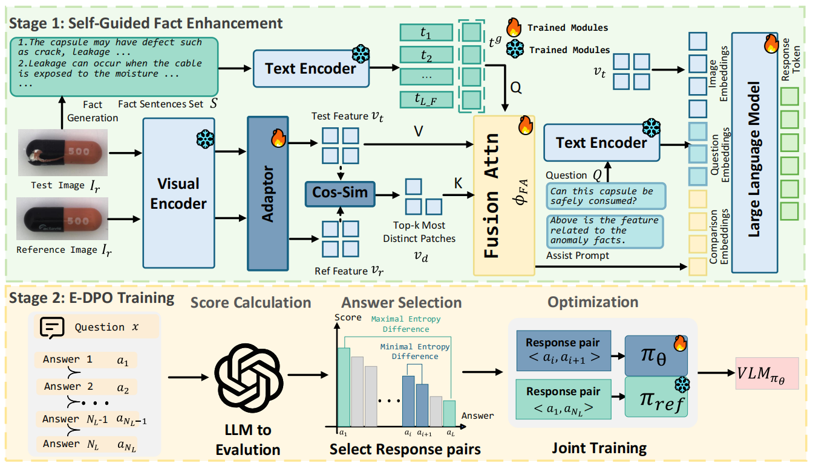

# SAGE (ACM Multimedia 2025)
This is the official repository for our recent paper "SAGE: A Visual Language Model for Anomaly Detection via Fact Enhancement and Entropy-aware Alignment".
# Dataset
You can download our anomaly detection and reasoning dataset **AD-PL** from [AD-PL](https://pan.baidu.com/s/1Jr68D6ysgdEFgOB0UTZJdw?pwd=b2nd)
More dataset can be used for training and testing: [MANTA](https://grainnet.github.io/MANTA) and [MMAD](https://github.com/jam-cc/MMAD).
# Model Architecture

# Installation
## Requirements
Python 3.8+

PyTorch 1.9+

CUDA 11.0+ (for GPU training)
## Environment Setup
### Using requirements.txt
```
# Create virtual environment
conda create -n sage python=3.10
conda activate sage

# Install exact dependencies (recommended for reproducibility)
pip install -r requirements.txt
```
