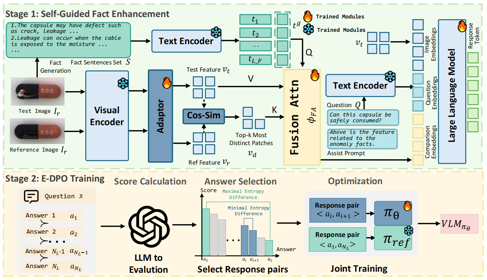

# SAGE (ACM Multimedia 2025)
This is the official repository for our recent paper "SAGE: A Visual Language Model for Anomaly Detection via Fact Enhancement and Entropy-aware Alignment".
# Dataset
You can download our anomaly detection and reasoning dataset **AD-PL** from [AD-PL](https://drive.google.com/drive/folders/17q_IuPSwytbbHQGMhADMkioiL8U-3RQD?usp=sharing)

More datasets can be used for training and testing: [MANTA](https://grainnet.github.io/MANTA) and [MMAD](https://github.com/jam-cc/MMAD).
# Model Architecture

# Installation
## Requirements
Python 3.10+

PyTorch 2+

CUDA 12.4+ 
## Environment Setup
### Using requirements.txt
```
# Create virtual environment
conda create -n sage python=3.10
conda activate sage

# Install exact dependencies (recommended for reproducibility)
pip install -r requirements.txt
```
# Quick Start
Downloading pre-trained [InternVL2-8B](https://huggingface.co/OpenGVLab/InternVL2-8B)

(Optional) You can use the `utils/discription_generate.py` to generate fact about the data offline.

Training stage1:
```
# Full finetuning
GPUS=8 PER_DEVICE_BATCH_SIZE=1 sh training/sfe_stage/shell/finetuning/internvl2_8b_finetune_full.sh
# Lora finetuning. After Lora sft, using utils/merge_lora.py to merge the model
GPUS=8 PER_DEVICE_BATCH_SIZE=1 sh training/sfe_stage/shell/finetuning/internvl2_8b_finetune_lora.sh
```
Training stage2:
```
GPUS=8 PER_DEVICE_BATCH_SIZE=1 sh training/edpo_stage/shell/internvl2_8b_edpo_full.sh
```
# Inference&Eval
inference, acc and MLE evaluation scripts can be used in `utils`.
# Acknowledge
This work is implemented based on [InternVL](https://github.com/OpenGVLab/InternVL) and [deepspeed](https://www.deepspeed.ai/). We greatly appreciate their valuable contributions to the community.
# Lisence
This project is licensed under the Apache-2.0 License - see the [LICENSE](LICENSE) file for details.
```
@inproceedings{zang2025sage,
  title={SAGE: A Visual Language Model for Anomaly Detection via Fact Enhancement and Entropy-aware Alignment},
  author={Zang, Guoxin and Li, Xue and Di, Donglin and Nie, Lanshun and Zhan, Dechen and Song, Yang and Fan, Lei},
  booktitle={Proceedings of the 33rd ACM International Conference on Multimedia},
  pages={5030--5039},
  year={2025}
}
```
